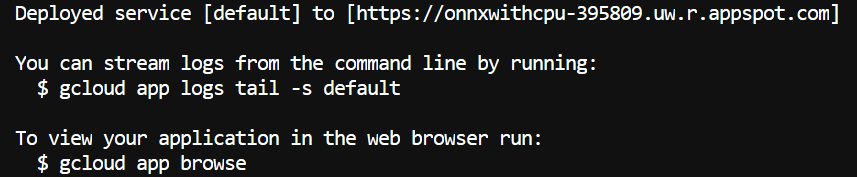
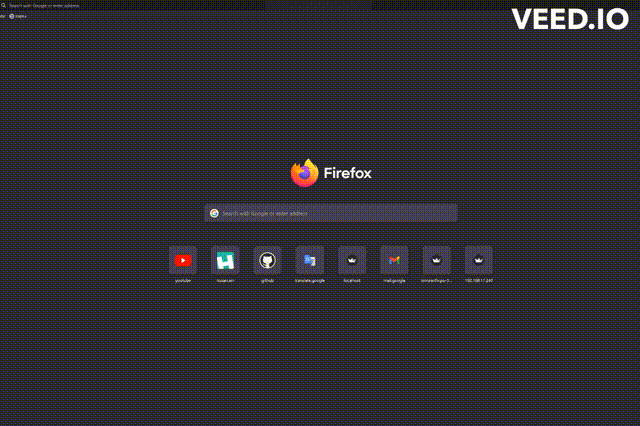

# Deploy Yolov8 model on GCP(Google Cloud Platform)

## Introduction

Google Cloud Platform (GCP), offered by Google, is a suite of cloud computing services that runs on the same infrastructure that Google uses internally for its end-user products, such as Google Search, Gmail, Google Drive, and YouTube. Alongside a set of management tools, it provides a series of modular cloud services including computing, data storage, data analytics and machine learning. Registration requires a credit card or bank account details.


Deploying is done through the [streamlit](https://docs.streamlit.io/) module.

## Create deployment files

Two files are required for the project. These are **Dockerfile**, **app.yaml** and **requirements.txt**. If other files are needed, this list will increase.<br>
<font color="blue"> **Dockerfile** </font> must contained following codes:

```console
FROM python:3.9
WORKDIR /app
COPY requirements.txt ./requirements.txt
RUN pip3 install -r requirements.txt
RUN apt-get update && apt-get install ffmpeg libsm6 libxext6  -y
EXPOSE 8080
COPY . /app
CMD streamlit run --server.port 8080 --server.enableCORS false stream.py

```

This code may vary depending on the project you are working on. For example, in the command on the last line, you can change the name of the streamlit file or the port number that you need.

<font color="red"> **app.yaml** </font> must contained following codes:

```console
runtime: custom
env: flex
automatic_scaling:
  min_num_instances: 1
  max_num_instances: 2
```

<font color="green"> **requirements.txt** </font> file contains all requirement python modules.

All the files discussed above should be located in the same path:

```bash
your project path/
  -- Dockerfile
  -- app.yaml
  -- requirements.txt
```

## ⚡ Usage

### Setting up Google Cloud SDK

To check for your project from your terminal with gcloud you can use:

```
gcloud projects list
```

To change to the project you created you can use:

```
gcloud config set project your_projectname
```

To check for the current project you use:

```
gcloud config get-value project
```

### Deploying app

To deploy our app we will be using:

```
gcloud app deploy
```

If you have everything right, the result should look like this:



## 👀 Demos

Result of the project is as follows:



Also you can use this [link](https://onnx-396809.uw.r.appspot.com/) directly.

## 🔧 Dependencies and Installation

#### Requirements

- Python >= 3.9
- Linux (Ubuntu 22.04)

#### Installation

- [Docker](https://www.digitalocean.com/community/tutorials/how-to-install-and-use-docker-on-ubuntu-22-04)
- [GCloud](https://cloud.google.com/sdk/docs/install)
